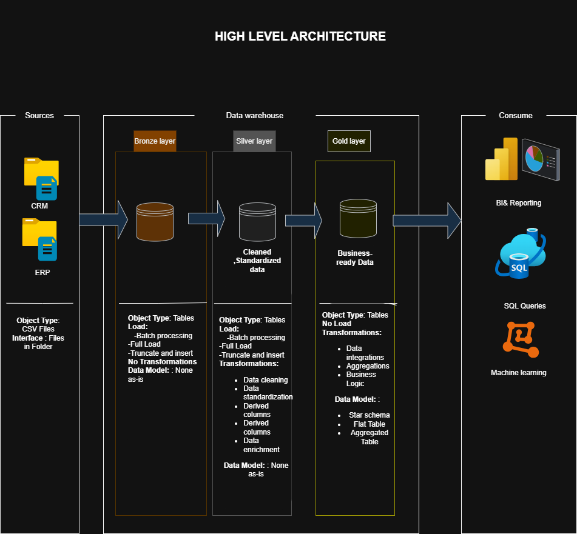

**Data warehouse and Analytics Project**
---
Welcome to the **Data warehouse and Analytics Project** repository !🚀  
This project demonstrates a comprehensive data warehousing and analytics solution, from building a data warehouse to generating actionable insights. Designed as a portfolio project, it highlights industry best practices in data engineering and analytics.

🏗️ Data Architecture  
The data architecture for this project follows Medallion Architecture Bronze, Silver, and Gold layers:
 
**Bronze Layer**: Stores raw data as-is from the source systems. Data is ingested from CSV Files into Snowflake Database. 
**Silver Layer**: This layer includes data cleansing, standardization, and normalization processes to prepare data for analysis. 
**Gold Layer**: Houses business-ready data modeled into a star schema required for reporting and analytics. 

---
📖 Project Overview 
This project involves: 
1-Data Architecture: Designing a Modern Data Warehouse Using Medallion Architecture Bronze, Silver, and Gold layers. 
2-ETL Pipelines: Extracting, transforming, and loading data from source systems into the warehouse. 
3-Data Modeling: Developing fact and dimension tables optimized for analytical queries. 
4-Analytics & Reporting: Creating SQL-based reports and dashboards for actionable insights. 

**
🚀 Project Requirements  
Building the Data Warehouse 
**Objective** 
Develop a modern data warehouse using SQL Server to consolidate sales data, enabling analytical reporting and informed decision-making. 

**Specifications** 
.Data Sources: Import data from two source systems (ERP and CRM) provided as CSV files. 
.Data Quality: Cleanse and resolve data quality issues prior to analysis. 
.Integration: Combine both sources into a single, user-friendly data model designed for analytical queries. 
.Scope: Focus on the latest dataset only; historization of data is not required. 
.Documentation: Provide clear documentation of the data model to support both business stakeholders and analytics teams. 

---
📂 Repository Structure 
data-warehouse-project/ 
│
├── datasets/&nbsp;&nbsp;&nbsp;&nbsp;   # Raw datasets used for the project (ERP and CRM data) 
│
├── docs/&nbsp;&nbsp;&nbsp;&nbsp;                             # Project documentation and architecture details 
│   ├── etl.drawio&nbsp;&nbsp;&nbsp;&nbsp;                     # Draw.io file shows all different techniquies and methods of ETL 
│   ├── data_architecture.drawio&nbsp;&nbsp;&nbsp;&nbsp;       # Draw.io file shows the project's architecture 
│   ├── data_catalog.md&nbsp;&nbsp;&nbsp;&nbsp;                # Catalog of datasets, including field descriptions and metadata 
│   ├── data_flow.drawio&nbsp;&nbsp;&nbsp;&nbsp;                # Draw.io file for the data flow diagram 
│   ├── data_models.drawio&nbsp;&nbsp;&nbsp;&nbsp;              # Draw.io file for data models (star schema) 
│   ├── naming-conventions.md&nbsp;&nbsp;&nbsp;&nbsp;           # Consistent naming guidelines for tables, columns, and files 
│
├── scripts/&nbsp;&nbsp;&nbsp;&nbsp;                            # SQL scripts for ETL and transformations 
│   ├── bronze/&nbsp;&nbsp;&nbsp;&nbsp;                         # Scripts for extracting and loading raw data 
│   ├── silver/&nbsp;&nbsp;&nbsp;&nbsp;                         # Scripts for cleaning and transforming data 
│   ├── gold/&nbsp;&nbsp;&nbsp;&nbsp;                           # Scripts for creating analytical models 
│
├── tests/&nbsp;&nbsp;&nbsp;&nbsp;                              # Test scripts and quality files 
│
├── README.md&nbsp;&nbsp;&nbsp;&nbsp;                          # Project overview and instructions 
├── LICENSE&nbsp;&nbsp;&nbsp;&nbsp;                            # License information for the repository 
├── .gitignore&nbsp;&nbsp;&nbsp;&nbsp;                         # Files and directories to be ignored by Git 
└── requirements.txt&nbsp;&nbsp;&nbsp;&nbsp;                    # Dependencies and requirements for the project 
